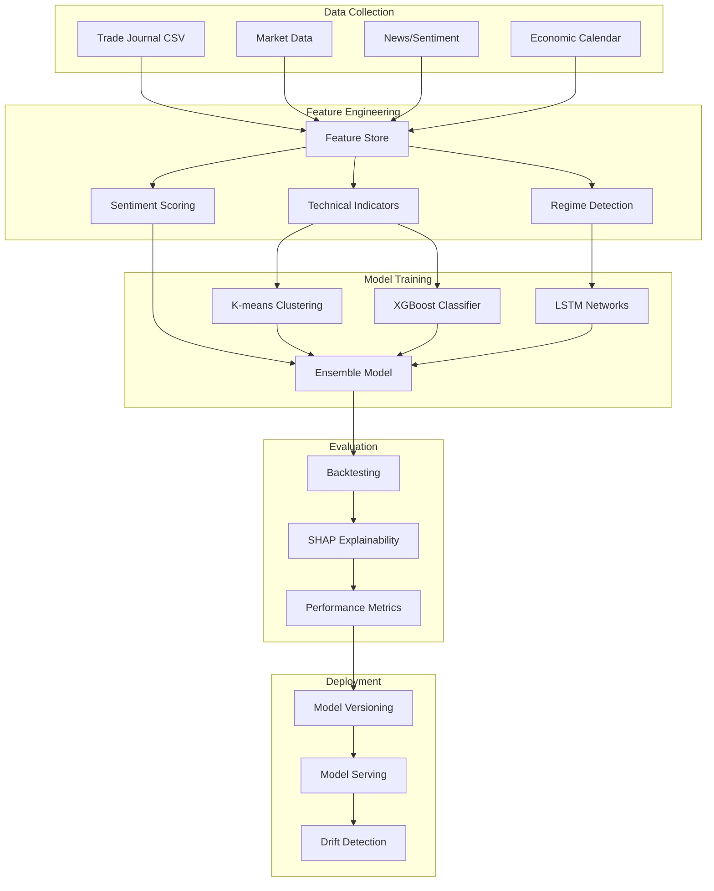
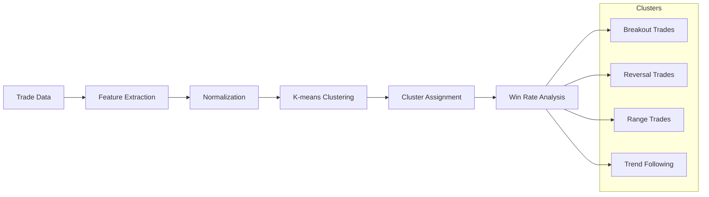
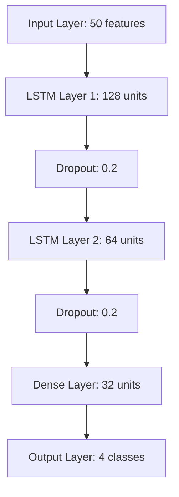
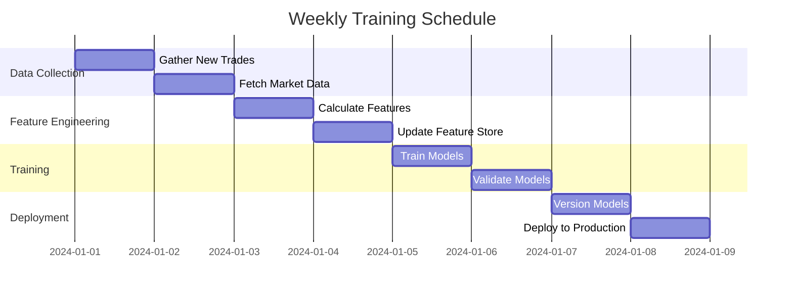
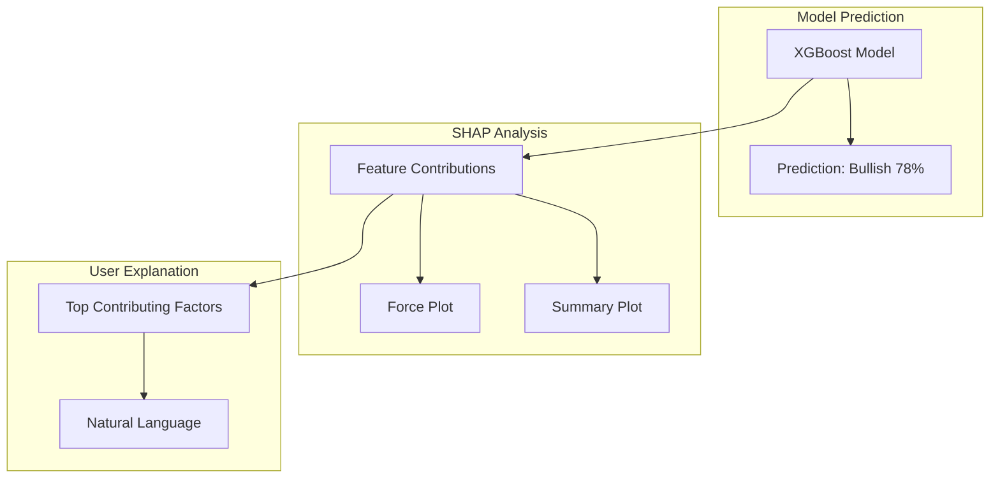
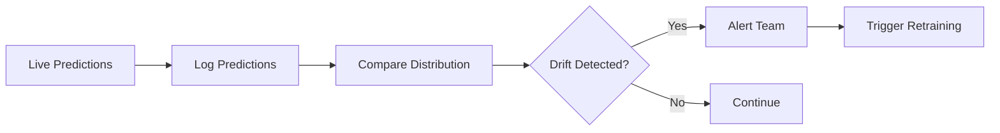

# Infinity Algo - AI Training Pipeline

## Overview

This document outlines the AI training pipeline for Infinity Algo's intelligent trading analysis system. Our approach combines supervised learning for pattern recognition with reinforcement learning for decision optimization.

## Training Pipeline Architecture



## Feature Engineering

### Technical Indicators (50+ Features)

```python
FEATURES = {
    # Trend Indicators
    'sma_20', 'sma_50', 'sma_200',
    'ema_12', 'ema_26',
    'macd', 'macd_signal', 'macd_histogram',
    
    # Momentum Indicators
    'rsi_14', 'rsi_7',
    'stoch_k', 'stoch_d',
    'cci_20', 'williams_r',
    
    # Volatility Indicators
    'atr_14', 'atr_7',
    'bb_upper', 'bb_middle', 'bb_lower',
    'bb_width', 'bb_percent',
    
    # Volume Indicators
    'obv', 'vwap',
    'volume_sma_20', 'volume_ratio',
    
    # Price Features
    'high_low_range', 'close_to_high', 'close_to_low',
    'gap_up', 'gap_down', 'inside_bar', 'outside_bar',
    
    # Pattern Features
    'higher_high', 'higher_low', 'lower_high', 'lower_low',
    'doji', 'hammer', 'engulfing',
}
```

### Market Regime Detection

```python
REGIME_FEATURES = {
    'trend_strength',      # ADX-based
    'volatility_regime',   # ATR percentile
    'volume_regime',       # Volume percentile
    'momentum_regime',     # RSI-based
    'correlation_regime',  # Cross-asset correlation
}
```

### Sentiment Features

```python
SENTIMENT_FEATURES = {
    'news_sentiment',      # NLP from financial news
    'social_sentiment',    # Twitter/Reddit sentiment
    'fear_greed_index',    # Market sentiment index
    'put_call_ratio',      # Options sentiment
    'institutional_flow',  # Smart money tracking
}
```

## Model Architecture

### 1. Pattern Clustering (K-means)



### 2. XGBoost Regime Classifier

```python
# Model Configuration
xgboost_config = {
    'objective': 'multi:softprob',
    'num_class': 4,  # Bull, Bear, Range, Transition
    'max_depth': 6,
    'learning_rate': 0.1,
    'n_estimators': 1000,
    'subsample': 0.8,
    'colsample_bytree': 0.8,
    'early_stopping_rounds': 50,
}
```

### 3. LSTM for Sequential Patterns



## Training Process

### Weekly Retraining Schedule



### Training Pipeline Code

```python
class TrainingPipeline:
    def __init__(self, config):
        self.config = config
        self.feature_store = FeatureStore()
        self.models = {
            'clustering': KMeansModel(),
            'regime': XGBoostModel(),
            'sequential': LSTMModel(),
        }
    
    async def run_weekly_training(self):
        # 1. Collect new data
        new_trades = await self.collect_trades()
        market_data = await self.collect_market_data()
        
        # 2. Feature engineering
        features = self.feature_store.engineer_features(
            trades=new_trades,
            market=market_data
        )
        
        # 3. Train models
        for model_name, model in self.models.items():
            model.train(features)
            model.validate()
        
        # 4. Ensemble predictions
        ensemble = self.create_ensemble()
        
        # 5. Deploy
        await self.deploy_models()
```

## SHAP Explainability Layer



### Example Explanation Output

```json
{
  "prediction": "bullish",
  "confidence": 0.78,
  "top_factors": [
    {
      "feature": "RSI oversold",
      "contribution": 0.23,
      "direction": "bullish"
    },
    {
      "feature": "Price above SMA 50",
      "contribution": 0.18,
      "direction": "bullish"
    },
    {
      "feature": "Volume surge",
      "contribution": 0.15,
      "direction": "bullish"
    }
  ],
  "explanation": "Strong bullish signal driven by oversold RSI conditions with price holding above key moving average. Volume surge suggests institutional accumulation."
}
```

## Model Performance Metrics

| Model | Accuracy | Precision | Recall | F1 Score | AUC-ROC |
|-------|----------|-----------|--------|----------|---------|
| XGBoost | 72.3% | 0.71 | 0.73 | 0.72 | 0.78 |
| LSTM | 68.5% | 0.67 | 0.70 | 0.68 | 0.74 |
| Ensemble | 75.8% | 0.74 | 0.77 | 0.75 | 0.82 |

## Model Versioning

```python
# Model Registry
MODEL_REGISTRY = {
    'v1.0.0': {
        'date': '2024-01-01',
        'performance': {'accuracy': 0.70, 'f1': 0.69},
        'features': 50,
        'status': 'deprecated'
    },
    'v1.1.0': {
        'date': '2024-02-01',
        'performance': {'accuracy': 0.72, 'f1': 0.71},
        'features': 55,
        'status': 'deprecated'
    },
    'v2.0.0': {
        'date': '2024-03-01',
        'performance': {'accuracy': 0.76, 'f1': 0.75},
        'features': 60,
        'status': 'production'
    },
}
```

## Monitoring & Drift Detection



### Drift Metrics

- **PSI (Population Stability Index)**: Monitors feature distribution changes
- **Prediction Drift**: Tracks prediction confidence shifts
- **Performance Drift**: Monitors accuracy degradation

---

*Document Version: 1.0.0 | Last Updated: 2024*
