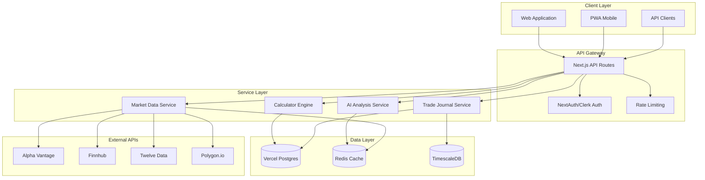
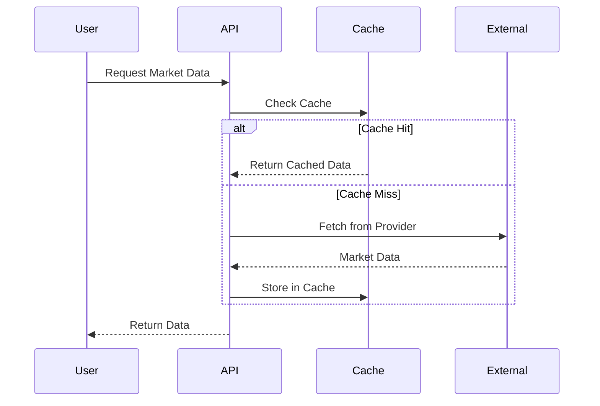
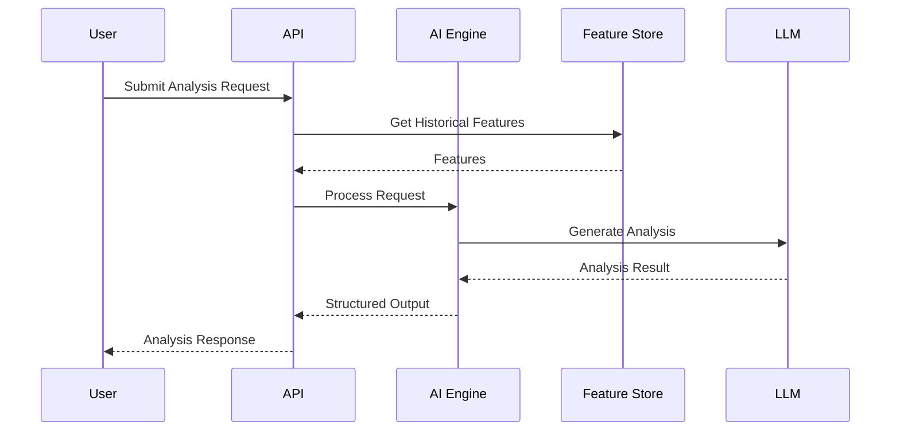
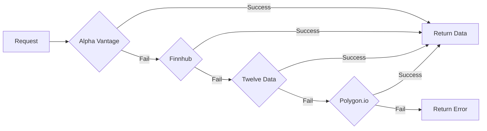

# Infinity Algo - Data Architecture

## Overview

Infinity Algo is designed with a scalable, enterprise-grade data architecture that supports real-time market data processing, AI-powered analysis, and seamless user experience.

## Architecture Diagram



## Data Flow

### 1. Market Data Pipeline



### 2. AI Analysis Pipeline



## Database Schema

### Core Tables

```sql
-- Users Table
CREATE TABLE users (
    id UUID PRIMARY KEY DEFAULT gen_random_uuid(),
    email VARCHAR(255) UNIQUE NOT NULL,
    name VARCHAR(255),
    subscription_tier VARCHAR(50) DEFAULT 'free',
    created_at TIMESTAMP DEFAULT NOW(),
    updated_at TIMESTAMP DEFAULT NOW()
);

-- Trade Journal
CREATE TABLE trade_journal (
    id UUID PRIMARY KEY DEFAULT gen_random_uuid(),
    user_id UUID REFERENCES users(id),
    symbol VARCHAR(20) NOT NULL,
    market VARCHAR(20) NOT NULL,
    direction VARCHAR(10) NOT NULL,
    entry_price DECIMAL(20, 8),
    exit_price DECIMAL(20, 8),
    stop_loss DECIMAL(20, 8),
    take_profit DECIMAL(20, 8),
    position_size DECIMAL(20, 8),
    pnl DECIMAL(20, 8),
    notes TEXT,
    created_at TIMESTAMP DEFAULT NOW()
);

-- AI Analysis History
CREATE TABLE ai_analysis (
    id UUID PRIMARY KEY DEFAULT gen_random_uuid(),
    user_id UUID REFERENCES users(id),
    market VARCHAR(20),
    symbol VARCHAR(20),
    timeframe VARCHAR(10),
    prompt TEXT,
    result JSONB,
    created_at TIMESTAMP DEFAULT NOW()
);

-- Calculator Results
CREATE TABLE calculator_results (
    id UUID PRIMARY KEY DEFAULT gen_random_uuid(),
    user_id UUID REFERENCES users(id),
    calculator_type VARCHAR(50) NOT NULL,
    inputs JSONB NOT NULL,
    result JSONB NOT NULL,
    created_at TIMESTAMP DEFAULT NOW()
);
```

## Caching Strategy

### Redis Cache Structure

```
market_data:{symbol}:{timeframe}  -> TTL: 60s
analysis:{user_id}:{symbol}        -> TTL: 300s
rates:{provider}                   -> TTL: 3600s
session:{user_id}                  -> TTL: 86400s
```

### Cache Invalidation Rules

1. **Market Data**: Invalidated every 60 seconds for real-time updates
2. **AI Analysis**: Cached for 5 minutes, invalidated on new data
3. **User Preferences**: Invalidated on profile update
4. **Rate Limiting**: Sliding window with 24-hour reset

## Data Providers Integration

### Primary Providers

| Provider | Markets | Rate Limit | Priority |
|----------|---------|------------|----------|
| Alpha Vantage | Stocks, Forex | 5 calls/min | Primary |
| Finnhub | Stocks, Crypto | 60 calls/min | Primary |
| Twelve Data | All | 8 calls/min | Secondary |
| Polygon.io | Stocks, Crypto | 5 calls/min | Secondary |

### Failover Strategy



## Security Considerations

1. **Authentication**: JWT tokens with NextAuth.js, OAuth2 with Clerk
2. **Data Encryption**: AES-256 at rest, TLS 1.3 in transit
3. **API Security**: Rate limiting, CORS policies, API key rotation
4. **User Data**: PII encryption, GDPR compliance, data retention policies

## Scaling Strategy

### Horizontal Scaling

- Stateless API servers behind load balancer
- Redis cluster for distributed caching
- Read replicas for Postgres databases

### Vertical Scaling

- TimescaleDB for time-series optimization
- Connection pooling with PgBouncer
- CDN for static assets

## Monitoring & Observability

- **Metrics**: Prometheus + Grafana dashboards
- **Logging**: Structured JSON logs to Datadog
- **Tracing**: OpenTelemetry for distributed tracing
- **Alerting**: PagerDuty integration for critical alerts

---

*Document Version: 1.0.0 | Last Updated: 2024*
