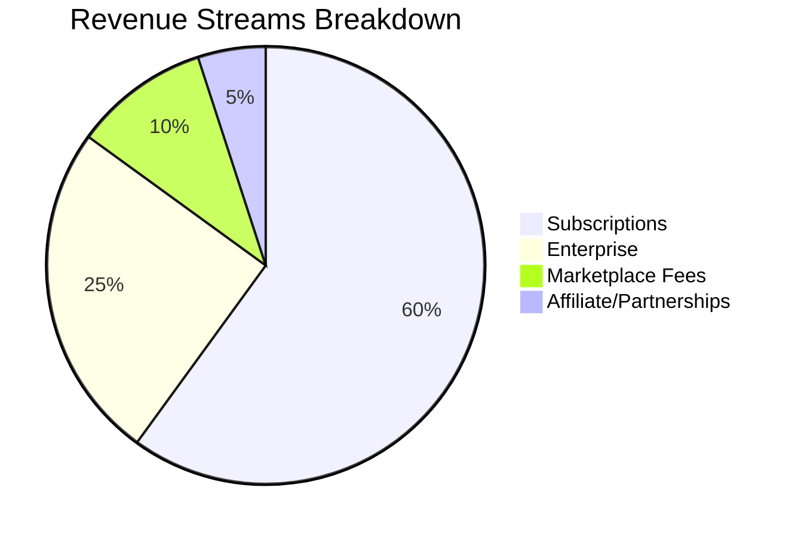
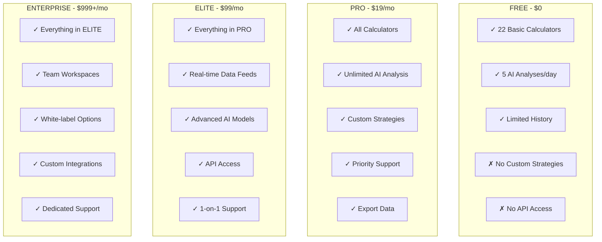
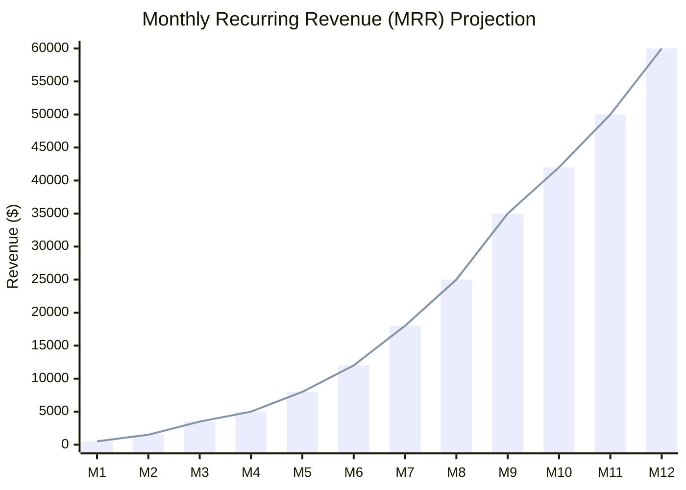
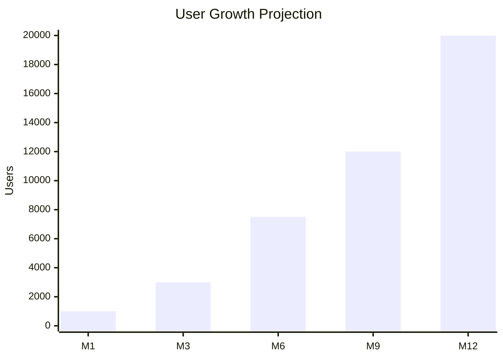
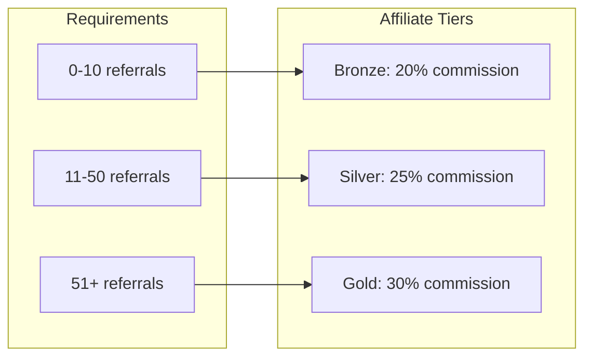
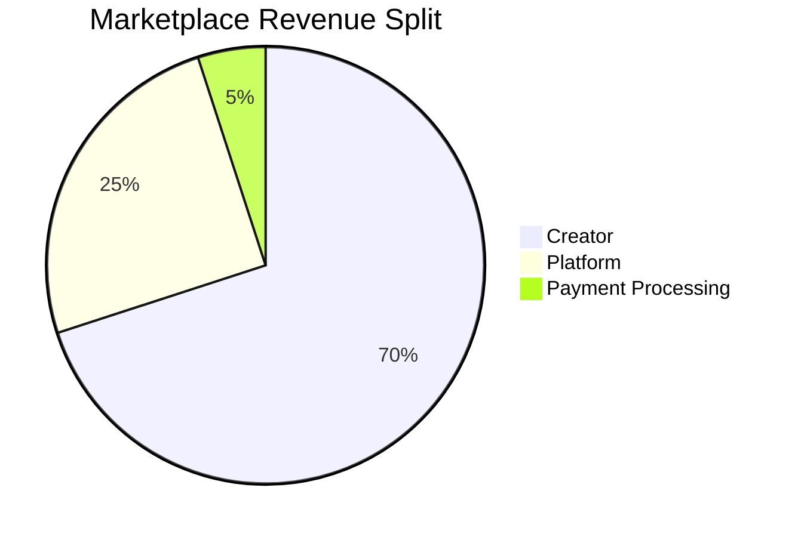
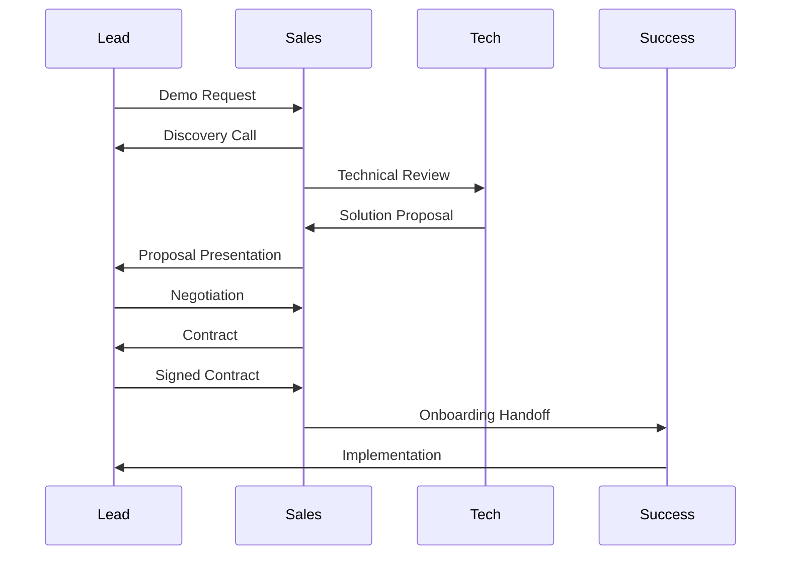
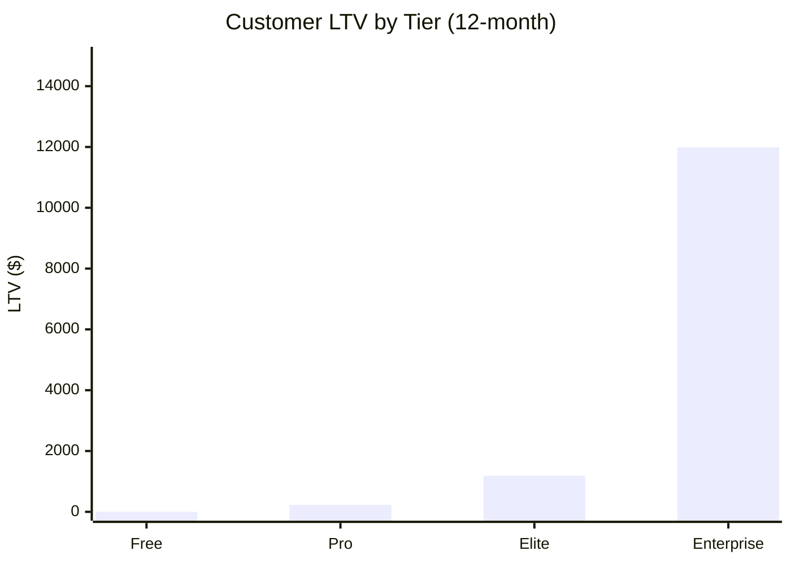
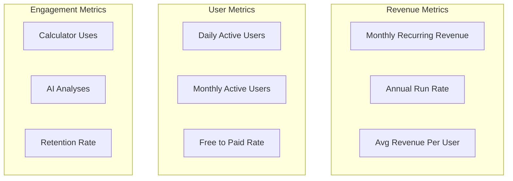

# Infinity Algo - Monetization Strategy

## Overview

Infinity Algo employs a freemium monetization model with multiple revenue streams, designed to maximize user acquisition while generating sustainable revenue from power users and enterprise clients.

## Revenue Model



## Pricing Tiers

### Tier Comparison



### Detailed Feature Matrix

| Feature | Free | Pro | Elite | Enterprise |
|---------|------|-----|-------|------------|
| **Calculators** |
| Basic Calculators | ✓ | ✓ | ✓ | ✓ |
| Advanced Calculators | Limited | ✓ | ✓ | ✓ |
| Custom Formulas | ✗ | ✓ | ✓ | ✓ |
| **AI Analysis** |
| Daily AI Analyses | 5 | Unlimited | Unlimited | Unlimited |
| Basic AI Model | ✓ | ✓ | ✓ | ✓ |
| Advanced AI Model | ✗ | ✗ | ✓ | ✓ |
| Custom Training | ✗ | ✗ | ✗ | ✓ |
| **Data & Integration** |
| Historical Data | 30 days | 1 year | Unlimited | Unlimited |
| Real-time Data | ✗ | ✗ | ✓ | ✓ |
| API Access | ✗ | ✗ | 10K calls/mo | Unlimited |
| Broker Integration | ✗ | ✓ | ✓ | ✓ |
| **Support** |
| Community Support | ✓ | ✓ | ✓ | ✓ |
| Email Support | ✗ | ✓ | ✓ | ✓ |
| Priority Support | ✗ | ✗ | ✓ | ✓ |
| Dedicated Manager | ✗ | ✗ | ✗ | ✓ |
| **Team Features** |
| Team Members | 1 | 1 | 3 | Unlimited |
| Role Management | ✗ | ✗ | ✓ | ✓ |
| SSO Integration | ✗ | ✗ | ✗ | ✓ |
| Audit Logs | ✗ | ✗ | ✗ | ✓ |

## Revenue Projections

### 12-Month Forecast



### User Growth Projection



### Revenue by Tier (Month 12)

| Tier | Users | Price | MRR |
|------|-------|-------|-----|
| Free | 17,000 | $0 | $0 |
| Pro | 2,000 | $19 | $38,000 |
| Elite | 150 | $99 | $14,850 |
| Enterprise | 15 | $999 | $14,985 |
| **Total** | **19,165** | - | **$67,835** |

## Affiliate Program

### Commission Structure



### Academy Partnership

```typescript
// Infinity Algo Academy Referral Integration
interface AcademyReferral {
  source: 'academy_link';
  discount: 20; // 20% off first month
  commission: 30; // 30% recurring
  cookieDuration: 30; // days
}

// Referral tracking
const trackReferral = (userId: string, source: string) => {
  // Track referral click
  analytics.track('referral_click', {
    userId,
    source,
    timestamp: new Date(),
  });
};
```

## Strategy Marketplace Fees

### Fee Structure



### Strategy Pricing Guidelines

| Category | Price Range | Platform Fee |
|----------|-------------|--------------|
| Basic Indicators | $0 - $9 | 20% |
| Advanced Strategies | $10 - $49 | 25% |
| Premium Systems | $50 - $199 | 25% |
| Enterprise Solutions | $200+ | Negotiable |

## Enterprise Sales

### Enterprise Package Options

| Package | Price | Includes |
|---------|-------|----------|
| **Starter** | $999/mo | 5 seats, API, Support |
| **Growth** | $2,499/mo | 15 seats, White-label |
| **Scale** | $4,999/mo | 50 seats, Custom Dev |
| **Custom** | Negotiable | Unlimited everything |

### Enterprise Sales Process



## Cost Structure

### Customer Acquisition Cost (CAC)

| Channel | CAC | LTV Ratio |
|---------|-----|-----------|
| Organic SEO | $5 | 1:100 |
| Paid Ads | $50 | 1:10 |
| Referrals | $10 | 1:50 |
| Enterprise Sales | $500 | 1:20 |

### Lifetime Value (LTV) by Tier



## Payment Processing

### Supported Payment Methods

- Credit/Debit Cards (Stripe)
- PayPal
- Apple Pay
- Google Pay
- Crypto (BTC, ETH, USDC)

### Subscription Management

```typescript
// Subscription Service
interface SubscriptionService {
  // Pricing
  plans: {
    free: PlanConfig;
    pro: PlanConfig & { price: 19 };
    elite: PlanConfig & { price: 99 };
    enterprise: PlanConfig & { price: 999 };
  };
  
  // Billing
  billingCycle: 'monthly' | 'yearly';
  yearlyDiscount: 0.2; // 20% off
  
  // Features
  upgrade(tier: Tier): Promise<void>;
  downgrade(tier: Tier): Promise<void>;
  cancel(): Promise<void>;
}
```

## Key Metrics & KPIs

### North Star Metrics

| Metric | Current | Target (12mo) |
|--------|---------|---------------|
| MRR | $0 | $50,000 |
| Active Users | 0 | 15,000 |
| Conversion Rate | 0% | 12% |
| Churn Rate | 0% | <5% |

### Monitoring Dashboard



---

*Document Version: 1.0.0 | Last Updated: 2024*
