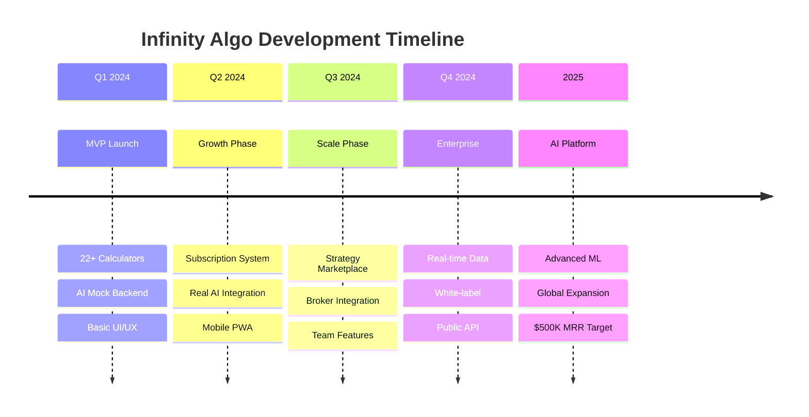
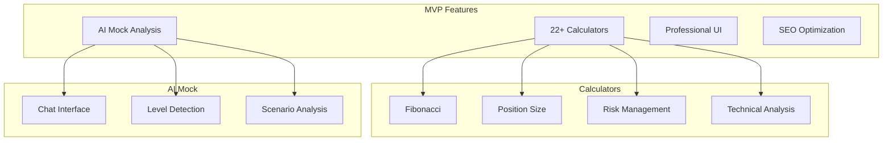
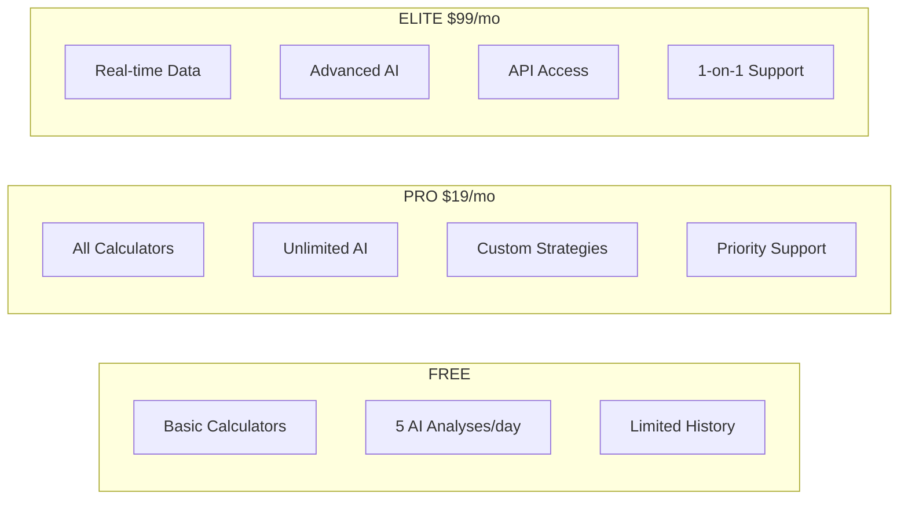
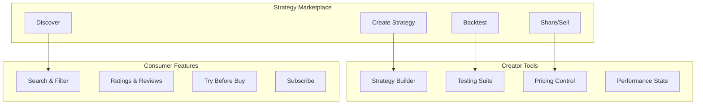
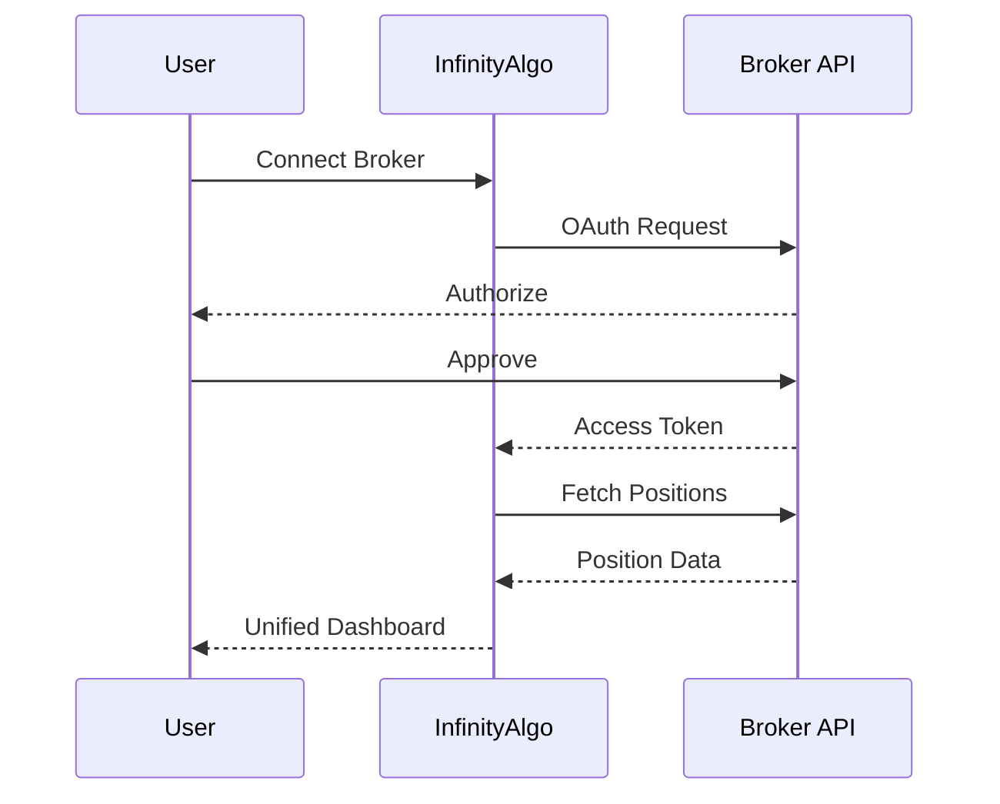
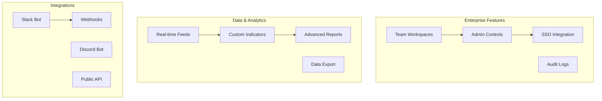
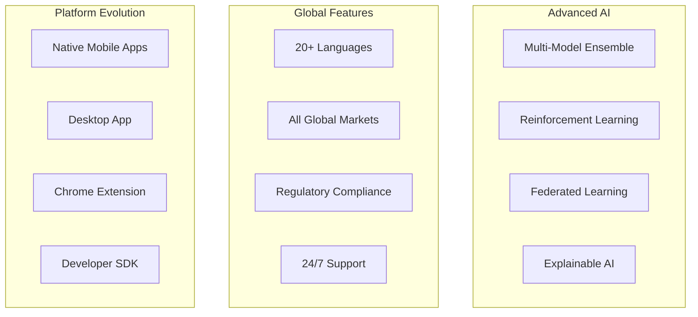
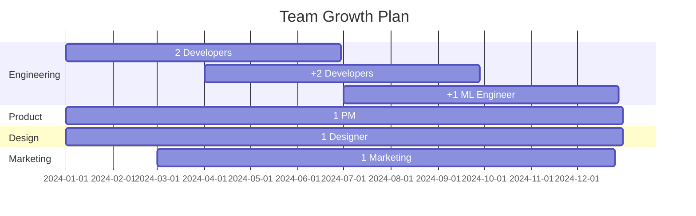

# Infinity Algo - 12-Month Product Roadmap

## Vision Statement

Build the world's most comprehensive AI-powered trading intelligence platform, democratizing professional-grade tools for every trader globally.

## Roadmap Overview



## Phase 1: MVP Launch (Month 1-2)

### Goals
- Launch functional MVP with core features
- Acquire first 1,000 users
- Establish brand presence with Infinity Algo Academy integration

### Features



### Success Metrics
| Metric | Target | Actual |
|--------|--------|--------|
| Users | 1,000 | - |
| Calculator Uses | 10,000 | - |
| AI Analyses | 5,000 | - |
| Academy Clicks | 500 | - |

## Phase 2: Growth Phase (Month 3-5)

### Goals
- Launch subscription system
- Integrate real AI backend
- Reach $5K MRR

### Features

#### Subscription Tiers



#### Real AI Integration

```python
# AI Backend Migration
class AIAnalysisService:
    def __init__(self, provider='openai'):
        self.provider = provider
        
    async def analyze(self, request: AnalysisRequest):
        # Real LLM integration
        response = await self.llm_client.chat.completions.create(
            model="gpt-4-turbo",
            messages=self._build_prompt(request),
            functions=self._get_functions()
        )
        return self._parse_response(response)
```

### Success Metrics
| Metric | Target | Actual |
|--------|--------|--------|
| MRR | $5,000 | - |
| Pro Users | 200 | - |
| Elite Users | 20 | - |
| Retention | 80% | - |

## Phase 3: Scale Phase (Month 6-8)

### Goals
- Launch Strategy Marketplace
- Add Broker Integration
- Reach 10,000 users

### Features

#### Strategy Marketplace



#### Broker Integration



### Supported Brokers
- MetaTrader 4/5
- TradingView
- Interactive Brokers
- Binance
- Coinbase Pro

### Success Metrics
| Metric | Target | Actual |
|--------|--------|--------|
| Total Users | 10,000 | - |
| MRR | $15,000 | - |
| Strategies Listed | 100 | - |
| Broker Connections | 1,000 | - |

## Phase 4: Enterprise Phase (Month 9-12)

### Goals
- Launch Enterprise tier
- Real-time data integration
- White-label solutions
- Reach $50K MRR

### Features

#### Enterprise Dashboard



#### White-Label Solution

```typescript
// White-label Configuration
interface WhiteLabelConfig {
  brand: {
    name: string;
    logo: string;
    primaryColor: string;
    secondaryColor: string;
  };
  domain: {
    customDomain: string;
    sslCertificate: boolean;
  };
  features: {
    calculators: string[];
    aiEnabled: boolean;
    customIntegrations: string[];
  };
}
```

### Success Metrics
| Metric | Target | Actual |
|--------|--------|--------|
| MRR | $50,000 | - |
| Enterprise Clients | 10 | - |
| API Calls/day | 100,000 | - |
| White-label Deployments | 5 | - |

## Phase 5: AI Platform (Year 2)

### Goals
- Advanced ML models
- Global expansion
- Target $500K MRR

### Advanced AI Features



## Risk Mitigation

### Technical Risks

| Risk | Impact | Mitigation |
|------|--------|------------|
| API Rate Limits | High | Multi-provider fallback |
| AI Costs | Medium | Caching + optimization |
| Data Security | Critical | Encryption + audits |

### Business Risks

| Risk | Impact | Mitigation |
|------|--------|------------|
| Competition | High | Unique features + community |
| User Churn | Medium | Engagement + retention |
| Regulatory | High | Legal compliance team |

## Resource Requirements

### Team Scaling



### Infrastructure Costs

| Phase | Monthly Cost | Services |
|-------|--------------|----------|
| MVP | $200 | Vercel, DB |
| Growth | $500 | + AI APIs |
| Scale | $2,000 | + Data feeds |
| Enterprise | $10,000 | + Dedicated |

---

*Document Version: 1.0.0 | Last Updated: 2024*
